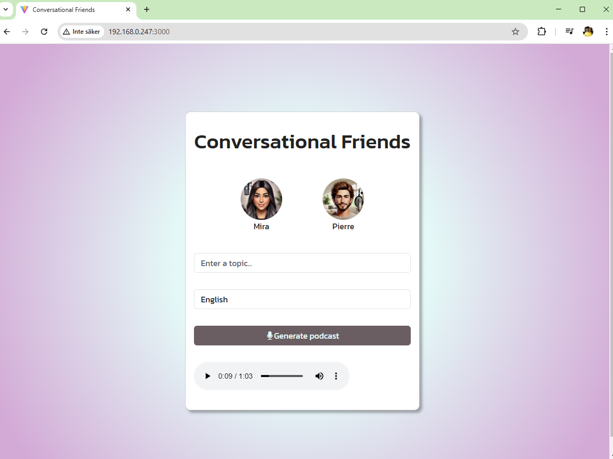
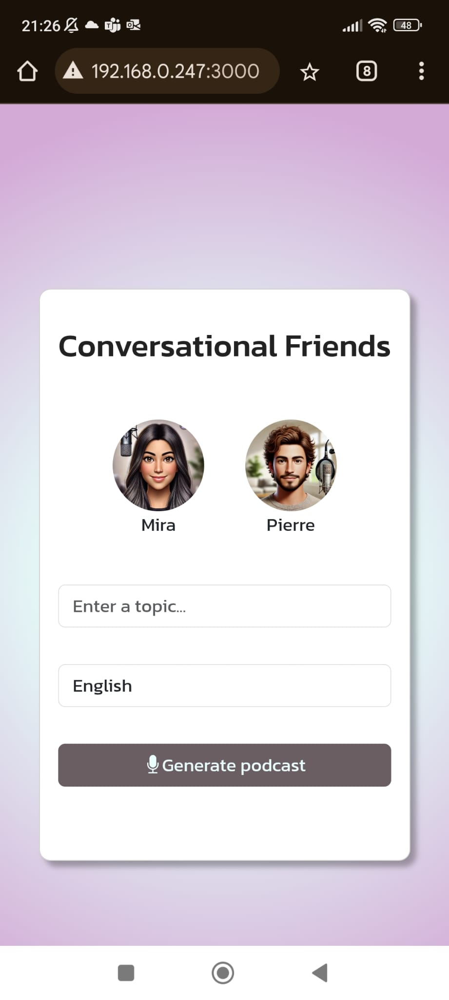

# ConversationalFriends

## About the project
I don't know about you guys, but I am sick and tired of constantly having to look for interesting podcasts to listen to. With this web app you don't have to! Just enter a topic you are interested in, and what language you want to listen to, and a podcast magically gets generated tailored just for YOU!

## Quick start
1. Install docker: https://docs.docker.com/engine/install/
2. Download the docker-compose file
3. Open it, and paste in your own open ai api key where specified
4. Open a terminal where the docker-compose file is, and enter docker compose up
5. Enyoy!

## Upcoming features

### Backend improvements
* Stream the generation of the content being created

### Frontend improvements
* Make the generated length of the podcast customizable
* Better design for the audio player
* Stream the generation of content as it is being created, to make the waiting feel more interactive and engaging

### Other
* Deploy the app to make it available online

## Pictures

|Desktop|
|------------------------|
| |

|Mobile|
|------------------------|
| |
